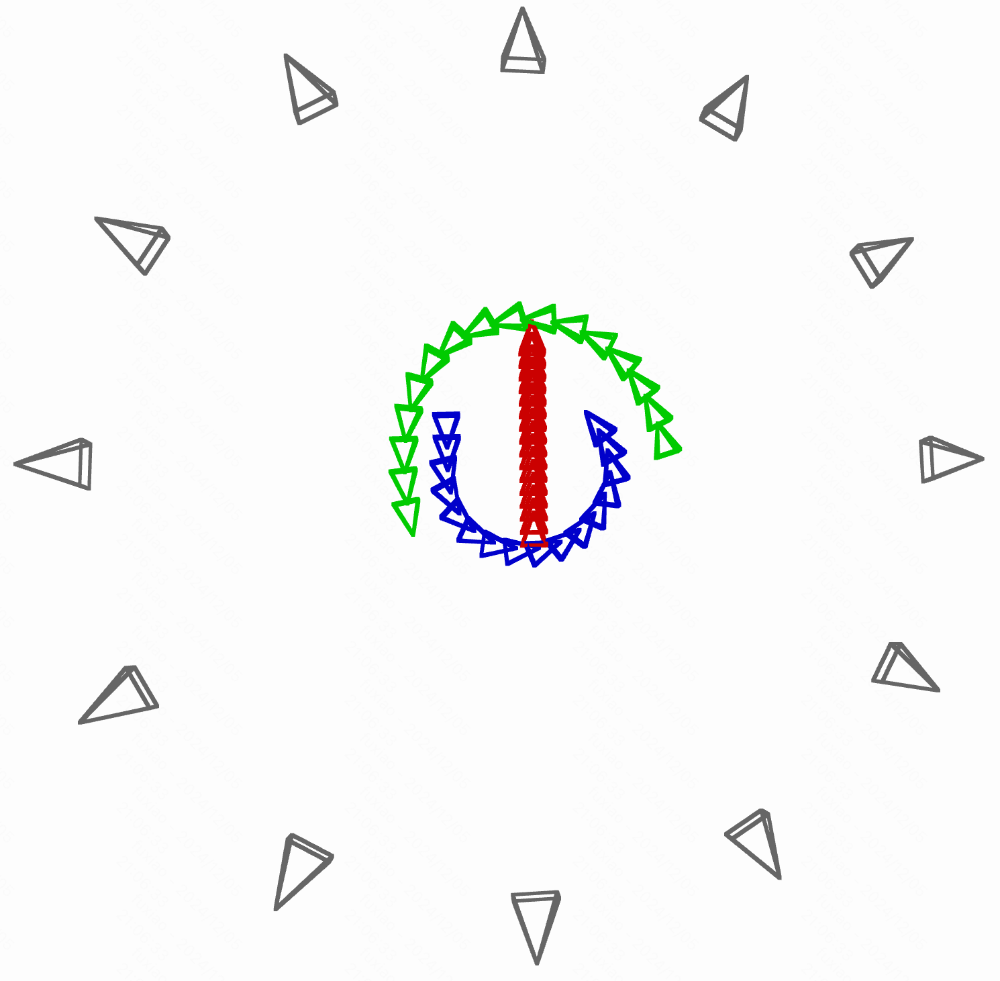

## ___***3DTrajMaster: Mastering 3D Trajectory for Multi-Entity Motion in Video Generation***___
<div align="center">
</img>

 &nbsp;
 <a href='http://fuxiao0719.github.io/projects/3dtrajmaster'></a> &nbsp;
 <a href='https://arxiv.org/pdf/2412.07759'></a> &nbsp;
 <a href='https://huggingface.co/datasets/KwaiVGI/360Motion-Dataset'></a> &nbsp;

**[Xiao Fu<sup>1 &dagger;</sup>](https://fuxiao0719.github.io/), 
[Xian Liu<sup>1</sup>](https://alvinliu0.github.io/), 
[Xintao Wang<sup>2 &#9993;</sup>](https://xinntao.github.io/), 
[Sida Peng<sup>3</sup>](https://pengsida.net/), 
[Menghan Xia<sup>2</sup>](https://menghanxia.github.io/), 
[Xiaoyu Shi<sup>2</sup>](https://xiaoyushi97.github.io/), 
[Ziyang Yuan<sup>2</sup>](https://scholar.google.ru/citations?user=fWxWEzsAAAAJ&hl=en), <br>
[Pengfei Wan<sup>2</sup>](https://scholar.google.com/citations?user=P6MraaYAAAAJ&hl=en)
[Di Zhang<sup>2</sup>](https://openreview.net/profile?id=~Di_ZHANG3),
[Dahua Lin<sup>1&#9993;</sup>](http://dahua.site/)** 
<br>
<sup>1</sup>The Chinese University of Hong Kong
<sup>2</sup>Kuaishou Technology
<sup>3</sup>Zhejiang University
<br>
&dagger;: Intern at KwaiVGI, Kuaishou Technology, &#9993;: Corresponding Authors

</div>

## 🌟 Introduction

🔥 3DTrajMaster controls **one or multiple entity motions in 3D space with entity-specific 3D trajectories** for text-to-video (T2V) generation. It has the following features:
- **6 Domain of Freedom (DoF)**: Control 3D entity location and orientation
- **Diverse Entities**: Human, animal, robot, car, even abstract fire, breeze, etc
- **Diverse Background**: City, forest, desert, gym, sunset beach, glacier, hall, night city, etc
- **Complex 3D trajectories**: 3D occlusion, rotating in place, 180°/continuous 90° turnings, etc
- **Fine-grained Entity Prompt**: Change human hair, clothing, gender, figure size, accessory, etc

https://github.com/user-attachments/assets/4925b19b-a3a9-498c-8131-053aae477604

🔥 **Release News**
- `[2024/12/10]` Release [paper](https://arxiv.org/pdf/2412.07759), [project page](http://fuxiao0719.github.io/projects/3dtrajmaster), [dataset](https://huggingface.co/datasets/KwaiVGI/360Motion-Dataset), and [code](https://github.com/KwaiVGI/3DTrajMaster).

## ⚙️ Quick Start

> **(1) Access to Our Internal Video Model**

As per company policy, we may not release the proprietary trained model at this time. However, if you wish to access our internal model, please submit your request via [a shared document](https://docs.google.com/spreadsheets/d/1HL96IS33fyzrDeXTt3hJ80ZsnfRBzDoKh8wparoBAGI/edit?pli=1&gid=0#gid=0) we’ve provided, or directly send us [email](mailto:3dtrajmaster@googlegroups.com) for request. We will respond to requests with the generated video as quickly as possible.
Please ensure your request includes the following:

1. Entity prompts (1–3, with a maximum of 42 tokens, approximately 20 words per entity)
2. Location prompt
3. Trajectory template (You can refer to the trajectory template in our released 360°-Motion Dataset, or simply describe new ones via text)

You can also send a kind reminder to us via [email](mailto:3dtrajmaster@googlegroups.com) to upload the video.

> **(2) Access to Publicly Available Codebase**

We are currently working on adapting our design to publicly available codebases (e.g., CogVideoX, LTX-Video, Mochi 1, Huanyuan). Below is a comparison between CogVideoX and our internal model as of 12.10. We will release an improved version for research purposes shortly.

https://github.com/user-attachments/assets/64ead629-35b2-4424-b771-610a0103022a

## 📦 360°-Motion Dataset ([Download 🤗](https://huggingface.co/datasets/KwaiVGI/360Motion-Dataset))
 ```
  ├── 360Motion-Dataset                      Video Number        Cam-Obj Distance (m)
    ├── 480_720/384_672
        ├── Desert (desert)                    18,000               [3.06, 13.39]
            ├── location_data.json
        ├── HDRI                                                      
            ├── loc1 (snowy street)             3,600               [3.43, 13.02]
            ├── loc2 (park)                     3,600               [4.16, 12.22]
            ├── loc3 (indoor open space)        3,600               [3.62, 12.79]
            ├── loc11 (gymnastics room)         3,600               [4.06, 12.32]
            ├── loc13 (autumn forest)           3,600               [4.49, 11.92]
            ├── location_data.json
        ├── RefPic
        ├── CharacterInfo.json
        ├── Hemi12_transforms.json
  ```

> **(1) Released Dataset Information (V1.0.0)**

| Argument                | Description |Argument                | Description |
|-------------------------|-------------|-------------------------|-------------|
| **Video Resolution**    | (1) 480×720 (2) 384×672    |       **Frames/Duration/FPS**        | 99/3.3s/30  |
| **UE Scenes**    | 6 (1 desert+5 HDRIs)  |       **Video Samples**        | (1) 36,000 (2) 36,000 |
| **Hemi12_transforms.json**    | 12 surrounding cameras |      **CharacterInfo.json**        | entity prompts  |
| **RefPic**    | 50 animals     |       **1/2/3 Trajectory Templates**       | 36/60/35 (121 in total) |
| **{D/N}_{locX}** | {Day/Night}_{LocationX} |  **{C}_ {XX}_{35mm}** | {Close-Up Shot}_{Cam. Index(1-12)} _{Focal Length}|

> **(2) Difference with the Dataset to Train on Our Internal Video Diffusion Model**

The release of the full dataset regarding more entities and UE scenes is 1) still under our internal license check, 2) awaiting the paper decision.

|  Argument              | Released Dataset |       Our Internal Dataset|
|-------------------------|-------------|-------------------------|
| **Video Resolution**    | (1) 480×720 (2) 384×672 |       384×672     |
| **Entities**    | 50 (all animals)     |      70 (20 humans+50 animals)  |
| **Video Samples**    | (1) 36,000 (2) 36,000   |    54,000   |
| **Scenes**    | 6  |   9 (+city, forest, asian town)  |
| **Trajectory Templates**    | 121 |   96  |

> **(3) Load Dataset Sample**

1. Change root path to `dataset`. We provide a script to load our dataset (video & entity & pose sequence) as follows. It will generate the sampled video for visualization in the same folder path.

    ```bash
    python load_dataset.py
    ```

2. Visualize the 6DoF pose sequence via Open3D as follows.

    ```bash
    python vis_trajecotry.py
    ```
    After running the visualization script, you will get an interactive window like this.

    


## 🚀 Benchmark Evaluation (Reproduce Paper Results)
  ```
  ├── eval
    ├── GVHMR
    ├── common_metrics_on_video_quality
  ```

> **(1) Evaluation on 3D Trajectory**

1. Change root path to `eval/GVHMR`. Then follow [GVHMR](https://github.com/zju3dv/GVHMR/blob/main/docs/INSTALL.md) installation to prepare the setups and  (recommend using a different Conda environment to avoid package conflicts).

2. Download the [inference videos](https://drive.google.com/file/d/1jMH2-ZC0ZBgtqej5Sp-E5ebBIX7mk3Xz/view?usp=drive_link) generated by our internal video diffusion model and corresponding [evalution GT poses](https://drive.google.com/file/d/1iFcPSlcKb_rDNJ85UPoThdl22BqR2Xgh/view?usp=drive_link) via the command below. You can check the 3D evaluated trajectory via our provided visualization script.
    ```bash
    bash download_eval_pose.sh
    ```

3. Estimation for human poses on evaluation sets:
    ```bash
    python tools/demo/demo_folder.py -f eval_sets -d outputs/eval_sets_gvhmr -s
    ```

4. Evaluation for all human samples (Note to convert the left and right hand coordinate systems) :
    ```bash
    python tools/eval_pose.py -f outputs/eval_sets_gvhmr
    ```

> **(2) Evaluation on Visual Quality**

1. Change root path to `eval/common_metrics_on_video_quality`. Then download [fvd](https://drive.google.com/file/d/1U2hd6qvwKLfp7c8yGgcTqdqrP_lKJElB/view?usp=drive_link), [inference videos](https://drive.google.com/file/d/1jMH2-ZC0ZBgtqej5Sp-E5ebBIX7mk3Xz/view?usp=drive_link) and [base T2V inference videos](https://drive.google.com/file/d/1kfdCDA5koYh9g3IkCCHb4XPch2CJAwek/view?usp=drive_link) through the download command below
    ```bash
    bash download_eval_visual.sh
    ```

2. Evaluation of FVD, FID, and CLIP-SIM metrics.
    ```bash
    pip install pytorch-fid  clip
    bash eval_visual.sh
    ```

## 📚 Related Work

- [MotionCtrl](https://github.com/TencentARC/MotionCtrl): the first to control 3D camera motion and 2D object motion in video generation
- [TC4D](https://sherwinbahmani.github.io/tc4d/): compositional text-to-4D scene generation with 3D trajectory conditions
- [Tora](https://ali-videoai.github.io/tora_video/): control 2D motions in trajectory-oriented diffusion transformer for video generation
- [SynCamMaster](https://jianhongbai.github.io/SynCamMaster/): multi-camera synchronized video generation from diverse viewpoints
- [StyleMaster](https://zixuan-ye.github.io/stylemaster): enable artistic video generation and translation with reference style image

####

## 🔗 Citation
If you find this work helpful, please consider citing:
```BibTeXw
@article{fu20243dtrajmaster,
    author  = {Fu, Xiao and Liu, Xian and Wang, Xintao and Peng, Sida and Xia, Menghan and Shi, Xiaoyu and Yuan, Ziyang and Wan, Pengfei and Zhang, Di and Lin, Dahua},
    title   = {3DTrajMaster: Mastering 3D Trajectory for Multi-Entity Motion in Video Generation},
    journal = {arXiv preprint arXiv:2412.07759},
    year    = {2024}
}
```
